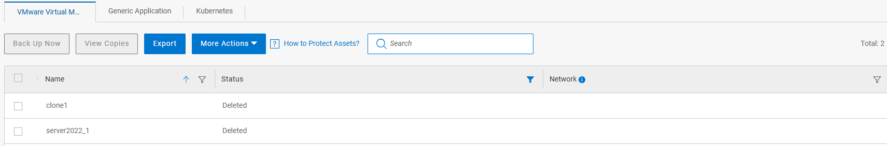
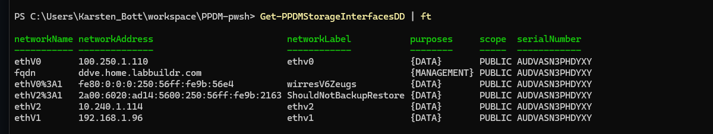
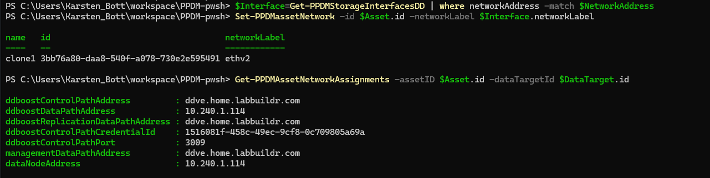

# Examples to assign DD Network Interfaces to assets using Network Tags
##
This Requires PPDM Modules >= 19.18.20
### Changing the Network Interface of a deleted, protected Asset:
First, we set some Basic Connection Parameters


```Powershell
$PPDMSytem="ppdm-demo.home.labbuildr.com" 
$AssetType="VMWARE_VIRTUAL_MACHINE"
$AssetName="clone1"
$NetworkAddress="10.240.1.114"
```
Now, we can connect to our PPDM System:

```Powershell
$PPDM=connect-PPDMSystem -PPDM_API_BaseURI $PPDMSytem -trustCert 
```

Let`s validate for our Asset beeing deleted:

```Powershell
$Asset=Get-PPDMassets -filter "name eq `"$AssetName`" and type eq `"$AssetType`" and status eq `"DELETED`"";$Asset
```


From above, we can alos see the "networkLabel" field is empty.
Same would be ssen in PPDM UI:


Next, we read the CopyMap for the Asset, to get the Primary Storage Unit for the System

```Powershell
$StorageUnit=(Get-PPDMcopy_map -AssetID $Asset.id).storageLocations[0].storageUnits
$DataTarget = Get-PPDMdata_targets -ID $STorageUnit.id
$DataTarget
```

With the Above, lets have a look at the current Assignments

```Powershell
Get-PPDMAssetNetworkAssignments -assetID $Asset.id -dataTargetId $DataTarget.id
``` 


Now lets change the Assignment
First, list the available Nics from the DD System(s)

```Powershell
Get-PPDMStorageInterfacesDD | ft
```



Now we select the Appropriate NetworkLabel base on our desired Address:


```Powershell
$Interface=Get-PPDMStorageInterfacesDD | where networkAddress -match $NetworkAddress
```
Assign the NetworkLabel to the Asset:

```Powershell
Set-PPDMassetNetwork -id $Asset.id -networkLabel $Interface.networkLabel
```


Now, lets validate the DataDomain Network Address Assignment:

```Powershell
 Get-PPDMAssetNetworkAssignments -assetID $Asset.id -dataTargetId $DataTarget.id
```

